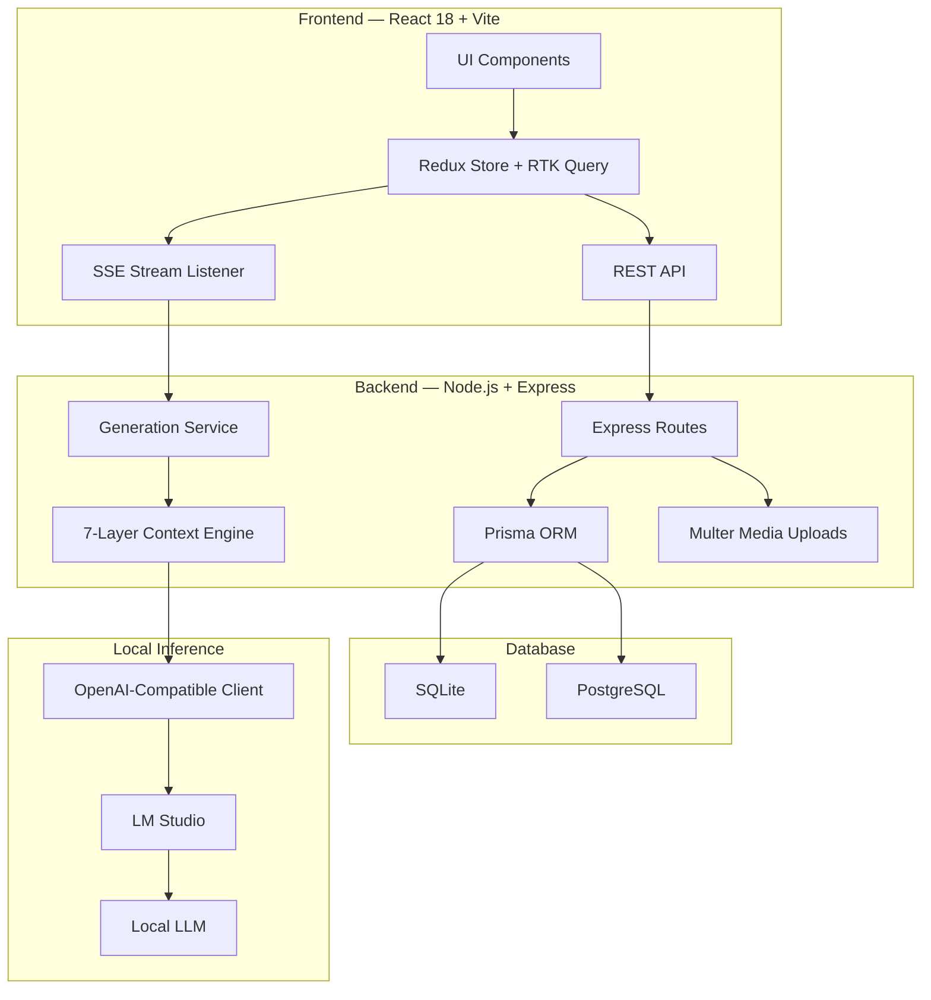

# Aegis — Local Character AI 🎭

A private, local-first Character AI system built around configurable characters, user personas, persistent memory, contextual conversation state, and local LLM inference.

Aegis runs the application, database, conversation state, and model inference locally. No conversation needs to leave your machine.

And yes, it is intentionally uncensored. The model does what the model does. There is no mysterious corporate filter sitting between you and your fictional characters.

---

## 🛡️ Why Aegis?

Most hosted character-AI platforms hide the interesting parts behind a single chat box.

Aegis takes the opposite approach.

The character's identity, personality, pronouns, user identity, memories, conversation history, summaries, and generation context are explicitly represented and assembled before every generation request.

The model is the generation engine.

Aegis is the context and conversation system around it.

That separation makes the application largely model-agnostic. LM Studio is currently used as the local inference server, but the architecture communicates through an OpenAI-compatible API rather than being tied to one specific model.

---

# ✨ Features

### ⚡ Real-Time SSE Token Streaming

Responses are streamed from the local inference server to the frontend using Server-Sent Events.

Instead of waiting for the entire response to finish, generated tokens appear progressively in the chat interface.

---

### 🔄 Multi-Swipe Regeneration

Every assistant turn can have multiple generated alternatives.

Generate another response, switch between available swipes, and keep the version that fits the conversation.

Each alternative belongs to the same conversational turn rather than becoming a completely separate message.

---

### ▶️ "Go On" Continuation

The conversation can continue without requiring a new user message.

The `Continue` generation flow allows the character to continue dialogue, narration, or an ongoing scene using the current conversation context.

---

### 🧠 Seven-Layer Context Architecture

Aegis does not throw the entire database at the model and hope for the best.

The generation context is assembled through seven logical layers:

1. Character Definition
2. Character Persona
3. User Definition
4. Pronoun & Participant Reference Map
5. Semantic Direction & Role Preservation
6. Recent Dialogue
7. Generation Context

Each layer has a different responsibility.

This keeps canonical identity, behavioural personality, participant identity, conversation state, and recent dialogue from becoming one giant undifferentiated prompt.

---

# 🧩 The Seven Layers

## 1. Character Definition

Defines who the character fundamentally is.

Example:

Maya is a calm librarian who loves old books.

This represents canonical character identity and is separate from temporary behavioural instructions.

The character definition should answer:

> "Who is this character?"

---

## 2. Character Persona

Defines how the character behaves and communicates.

Example:

She speaks warmly and becomes playful when discussing books.

This is intentionally separate from the character definition.

The distinction is:

Definition → Who the character is  
Persona → How the character behaves

This allows behaviour to be adjusted without rewriting the character's fundamental identity.

---

## 3. User Definition

The user is represented as an explicit participant rather than being treated as an anonymous chat sender.

A User Persona can contain its own:

- Name
- Description
- Avatar
- Gender
- Subject pronoun
- Object pronoun
- Possessive pronoun
- Determiner pronoun

This allows the same user to maintain different personas for different conversations.

For example:

Kishan  
Sarcastic Developer  
he / him / his / his

can exist independently from:

Brave Knight  
he / him / his / his

---

## 4. Pronoun & Participant Reference Map

Pronouns are explicitly associated with participants.

For example:

{{char}} = Maya
Gender = female
Subject = she
Object = her
Possessive = hers
Determiner = her

{{user}} = Kishan
Gender = male
Subject = he
Object = him
Possessive = his
Determiner = his

This gives the generation context an explicit participant-reference map instead of relying entirely on the model to infer identity.

Importantly, a pronoun identifies a participant.

It does NOT determine that participant's grammatical role.

---

## 5. Semantic Direction & Role Preservation

This layer protects the direction of actions described in the conversation.

Pronoun resolution and grammatical roles are treated as separate concepts.

For example:

"I handed her a book."

If `her = Maya`:

Actor → Kishan  
Action → hand  
Object → book  
Recipient → Maya

Whereas:

"She handed me the book."

means:

Actor → Maya  
Action → hand  
Object → book  
Recipient → Kishan

The same distinction applies to other relationships:

"I took the book from her."

→ Kishan takes  
→ Maya is the source

"I looked at her."

→ Kishan looks  
→ Maya is the target

"She looked at me."

→ Maya looks  
→ Kishan is the target

"I told her to wait."

→ Kishan tells  
→ Maya is the target / recipient

"She told me to wait."

→ Maya tells  
→ Kishan is the target / recipient

The system therefore does not treat a character pronoun such as `her` as automatically meaning "recipient".

The model is instructed to preserve the semantic relationships expressed by the user's sentence.

---

## 6. Explicit Recent Dialogue

Recent messages contain both structured participant information and explicit speaker attribution.

Instead of relying only on API metadata such as:

{
  "role": "user",
  "name": "Kishan",
  "content": "I handed her a book."
}

the model-visible content becomes:

Kishan: I handed her a book.

This makes the speaker identity visible directly inside the conversational content.

Assistant turns are similarly associated with the character.

This avoids depending on the specific behaviour of an inference server's chat template when interpreting message metadata.

---

## 7. Generation Context

The previous layers are assembled into the final model-facing context.

A typical context contains:

Character Definition
+
Character Origin / World Lore
+
Character Persona
+
User Definition
+
Participant / Pronoun Map
+
Semantic Role Preservation
+
Pinned Memories
+
Rolling Conversation Summary
+
Recent Dialogue

The result is sent to the local inference server for generation.

---

# 🧠 Memory & Conversation Continuity

Local models have limited context windows.

Aegis uses multiple mechanisms to maintain continuity without continuously sending the entire conversation.

### 📌 Pinned Memories

Important facts can be explicitly preserved.

Examples:

Maya has a mechanical arm.  
The user owns an old blue motorcycle.  
The library closes at midnight.

These memories can be injected into future generation contexts.

---

### 📜 Rolling Conversation Summary

Older conversation turns can be compressed into a rolling summary.

Instead of keeping every historical message at full length forever:

Old conversation
↓
Summarization
↓
Rolling Summary
↓
Future Context

Recent messages remain available in detail while older history can be represented more compactly.

---

### 🌳 Message Swipes

Alternative assistant generations remain attached to their original conversation turn.

Conceptually:

User
│
└── Assistant Turn
    ├── Swipe 1
    ├── Swipe 2
    └── Swipe 3

This allows regeneration without destroying the conversational structure.

---

# 🏗️ Architecture



---

# 🛠️ Technology Stack

### Frontend

* React 18
* TypeScript
* Vite
* Tailwind CSS
* Redux Toolkit
* RTK Query

### Backend

* Node.js
* Express
* TypeScript
* Prisma
* Multer
* Server-Sent Events

### Database

* SQLite for local development
* PostgreSQL for deployment / larger installations

### Local Inference

Aegis communicates with an OpenAI-compatible local inference endpoint.

Currently tested with:

* LFM 2.5
* NVIDIA Nemotron

The application architecture does not depend on either model specifically.

LM Studio acts as the local inference server.

---

# 🗄️ Database Model

## Character

Stores the character's identity and configuration.

Includes:

* `id`
* `name`
* `tagline`
* `description`
* `greeting`
* `systemPrompt`
* `exampleDialogue`
* `persona`
* `gender`
* `pronounSubject`
* `pronounObject`
* `pronounPossessive`
* `pronounDeterminer`

---

## UserPersona

Represents a configurable user identity.

Includes:

* `name`
* `description`
* `avatarUrl`
* `isDefault`
* `gender`
* `pronounSubject`
* `pronounObject`
* `pronounPossessive`
* `pronounDeterminer`

---

## Session

Represents a specific conversation between:

Character + User Persona

The session also tracks conversation state such as:

* Context information
* Token usage
* Context window information
* Rolling summary
* Conversation history

---

## Message

Represents an individual conversational turn.

Messages retain:

* Sender role
* Participant name
* Message content
* Ordering information
* Swipe variants

---

## Memory

Stores persistent conversational facts that can be injected into future contexts.

---

# 🔌 API

The backend exposes REST endpoints for character management, personas, sessions, messages, memory, and generation.

### Characters

```text
GET    /api/characters
GET    /api/characters/:id
POST   /api/characters
PUT    /api/characters/:id
DELETE /api/characters/:id
```

### Sessions & Messages

```text
GET    /api/sessions
POST   /api/sessions

GET    /api/messages
POST   /api/messages/batch-delete
```

### Generation

```text
POST /api/generate/stream
POST /api/generate/regenerate
POST /api/generate/continue
```

Generation requests are responsible for assembling the current session context and communicating with the configured local inference server.

---

# 🎨 Interface

Aegis includes several UI systems around the core conversation engine.

### Character Configuration

Characters can be configured with:

* Definition
* Persona
* Gender
* Pronouns
* Greeting
* World / lore information
* Example dialogue
* Visual assets

### User Persona

User personas can be created and switched independently.

### Ambient Media

The interface supports:

* Wallpapers
* GIF / WebP backgrounds
* Blur
* Dimming
* Ambient visual effects

### Zen Mode

A minimal conversation mode that removes unnecessary interface elements and focuses on the conversation.

### Responsive UI

The interface is designed for desktop and mobile layouts, including dynamic viewport handling for mobile browser toolbars.

---

# 🚀 Quick Start

## Prerequisites

* Node.js 18+
* Git
* LM Studio or another OpenAI-compatible local inference server

---

## Installation

```bash
git clone https://github.com/kishan601/Character-AI.git
cd Character-AI

npm install
npm --prefix server install
npm --prefix client install
```

---

## Environment

Copy the example environment file:

```bash
cp server/.env.example server/.env
```

Example:

```env
PORT=3001
DATABASE_URL="file:./dev.db"
LM_STUDIO_URL="http://127.0.0.1:1234/v1"
```

---

## Database

```bash
npm --prefix server run prisma:push
npm --prefix server run prisma:generate
```

---

## Run

```bash
npm run dev
```

Frontend:

[http://localhost:5173](http://localhost:5173)

Backend:

[http://localhost:3001](http://localhost:3001)

LM Studio:

[http://127.0.0.1:1234](http://127.0.0.1:1234)

---

# 🔧 Troubleshooting

### LM Studio is offline

Check that:

1. LM Studio is running.
2. Its local server is started.
3. The configured port matches `LM_STUDIO_URL`.
4. The selected model is loaded.

---

### Database errors

Run:

```bash
npm --prefix server run prisma:push
npm --prefix server run prisma:generate
```

Then restart the development server.

---

### Messages aren't saving

Check the backend terminal for errors and verify that the database connection is working.

---

### Mobile layout looks broken

Refresh the application and clear stale browser assets if necessary.

Aegis uses dynamic viewport units for mobile layouts, but browsers occasionally enjoy pretending CSS never existed.

---

# 🔐 Privacy

Aegis is designed around local-first operation.

When configured with a local inference server:

Your Browser
↓
Local Aegis Server
↓
Local Database
↓
Local Inference Server
↓
Local Model

Conversation data does not need to be sent to a hosted AI provider.

Your characters, conversations, personas, memories, and model inference can remain on your machine.

---

# 📈 Model Performance

Aegis is intentionally separated from the underlying model.

Different models can be tested without redesigning the conversation architecture.

For example:

Aegis
│
└── OpenAI-Compatible API
│
├── LFM 2.5
│
└── NVIDIA Nemotron

During testing, smaller models provided very fast generation but showed weaker conversational role and perspective handling in some scenarios.

A larger local model demonstrated substantially more reliable participant and conversational-context handling using the same Aegis architecture.

This is an important design property:

> The application architecture and the model are separate concerns.

---

# 🧪 End-to-End Testing (Cypress)

Aegis AI includes a full suite of automated Cypress E2E tests covering desktop and mobile workflows:

```bash
# Run headless Cypress E2E test suite
npm --prefix client run test:e2e

# Open interactive Cypress test runner
npm --prefix client run cypress:open
```

### Test Coverage Highlights:
- **Navigation & Discovery**: Character grid cards, instant debounced search filter, category tags.
- **Chat & Streaming**: SSE response ingestion, real-time `ThinkingIndicator` transitions, abort generation.
- **Sidebar & Sessions**: Desktop resize handle, overlay collapse animations, multi-session persistence.
- **Character Creator**: Multi-step creation form, avatar crop modals, dynamic macro interpolation.
- **Mobile Viewports**: Capacitor WebView simulation (375x812), pull-to-refresh elastic drag, safe-area insets.

---

# 🤝 Contributing

Pull requests are welcome.

Please keep contributions focused, typed, and reasonably sane.

Aegis does not need a 47-package dependency injection framework to create a chat message.

Keep it simple.

Keep it local.

Keep it fast.

---

# 📄 License

MIT License.

You are free to use, copy, modify, merge, publish, distribute, sublicense, and sell copies of the software.

Just don't blame us when you spend fourteen hours talking to a fictional character instead of going outside.

You've been warned. 🎭
