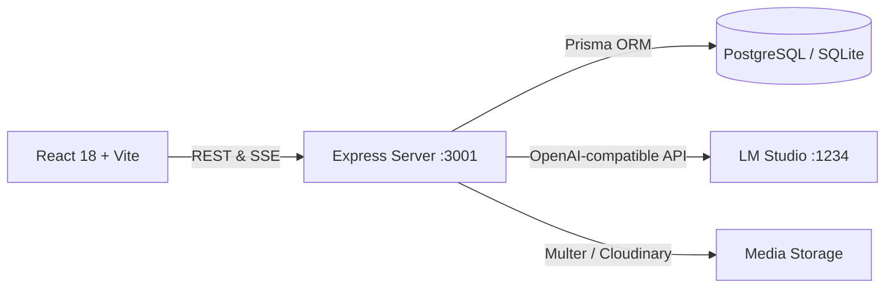

# Aegis — Uncensored Local Character AI

A high-performance, private, and uncensored Character.ai alternative running locally with **LM Studio**, **React 18**, **Node.js/Express**, and **PostgreSQL (Neon) / SQLite**.

---

## ✨ Features

- **⚡ Zero-Lag SSE Token Streaming**: Ultra-responsive chat responses streaming real-time tokens via Server-Sent Events.
- **🔄 Multi-Swipe Regeneration**: Generate multiple candidate responses for any assistant turn and seamlessly swipe through them.
- **▶️ "Go On" Story Continuation Engine**: Prompt the character to naturally extend their dialogue, narration, or actions without requiring a dummy user message.
- **🧠 Pinned Memories & Dynamic Lore**: Pin key facts, backstory, and world lore directly into the LLM's prompt context.
- **📜 Rolling Conversation Summarizer**: Background engine that periodically condenses older message turns to maintain context continuity beyond token limits.
- **👤 User Persona Management**: Create and switch user personas on the fly to control how characters perceive and address you.
- **🖼️ Ambient Wallpaper & Media Studio**: Fullscreen background artwork with customizable gaussian blur, dimming, ambient halo glow, and interactive image cropping with animated WebP / GIF support.
- **🧘 Zen Mode**: Minimalist, distraction-free reading and chatting view with smooth backdrop transitions.
- **📱 Fully Responsive Mobile Design**: Single-line compact image controls and touch-friendly layouts optimized for phones and tablets.

---

## 🛠️ Architecture & Tech Stack



### Frontend (`/client`)
- **Framework**: React 18, Vite, TypeScript
- **Styling**: Tailwind CSS, Glassmorphism, Custom Animations
- **State Management**: Redux Toolkit & RTK Query
- **Motion & Icons**: Framer Motion, Lucide Icons

### Backend (`/server`)
- **Server**: Express.js, TypeScript, TSX
- **ORM & Database**: Prisma ORM with dual-support for PostgreSQL (Neon) and SQLite
- **Token Management**: `gpt-tokenizer` sliding context window calculator
- **Media**: Multer, Cloudinary SDK
- **LLM Integration**: OpenAI-compatible client for LM Studio / Ollama / Local Models

---

## 🚀 Quick Start

### 1. Prerequisites
- **Node.js** (v18 or higher)
- **LM Studio** (or any OpenAI-compatible runner on port `1234`)

### 2. Installation
Clone the repository and install all dependencies:
```bash
git clone https://github.com/kishan601/Character-AI.git
cd Character-AI
npm install
npm --prefix server install
npm --prefix client install
```

### 3. Environment Configuration
Copy the example environment file in the `server` directory:
```bash
cp server/.env.example server/.env
```
Configure your database URL and LM Studio endpoint in `server/.env`:
```env
PORT=3001
DATABASE_URL="file:./dev.db"
LM_STUDIO_URL="http://127.0.0.1:1234/v1"
```

### 4. Database Setup
Initialize the database and seed initial characters:
```bash
npm --prefix server run prisma:push
npm --prefix server run prisma:generate
```

### 5. Running the Application
Start both the backend server and frontend client concurrently:
```bash
npm run dev
```
Or double-click `start.bat` on Windows.

- **Frontend**: `http://localhost:5173`
- **Backend API**: `http://localhost:3001`

---

## 📄 License
MIT License. Built for privacy, performance, and uncensored local storytelling.
